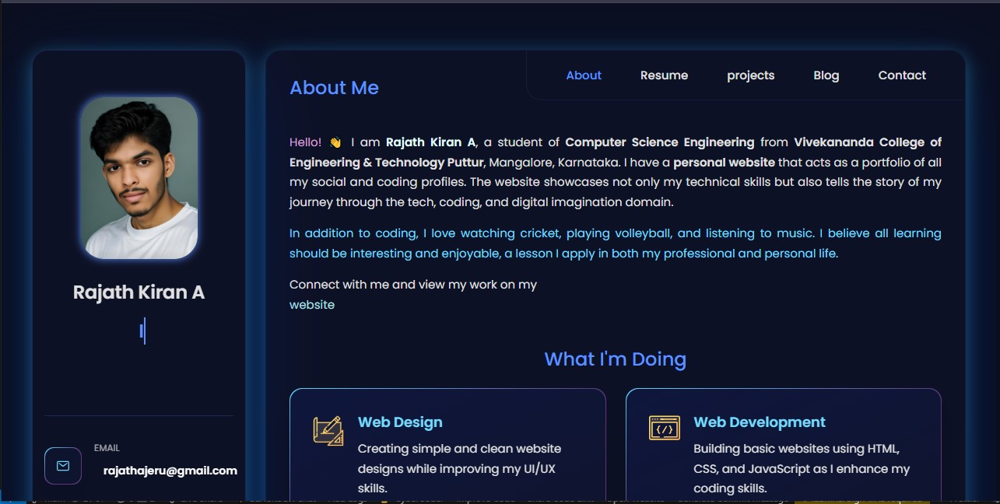

# Personal Portfolio ⚡️

A clean, modern, responsive portfolio website for developers.

**Live Demo:** [rajathkiran.io](https://rajathkiran.netlify.app/)

> **Note:** This project is based on [vCard Personal Portfolio](https://github.com/codewithsadee/vcard-personal-portfolio) by [@codewithsadee](https://github.com/codewithsadee) and has been modified to suit personal requirements.

## Preview



⭐ Star me on GitHub — it helps!

## Features 📋

⚡️ Fully Responsive  
⚡️ Modern Design  
⚡️ Smooth Animations  
⚡️ Mobile-First Approach  
⚡️ Performance Optimized  
⚡️ Easy to Customize  

## Installation & Deployment 📦

* Clone the repository and modify the content according to your requirement
* Update personal information in `script.js` and `index.html`
* Add or remove images from `assets/images/` directory as needed
* Deploy using **Netlify** or **GitHub Pages** for the easiest setup

## Quick Start 🚀

```bash
git clone https://github.com/Rajath2005/rajathkiran.io.git
cd rajathkiran.io
# Open index.html in your browser or use a local server
```

## Sections 📚

✔️ About  
✔️ Skills  
✔️ Projects  
✔️ Experience  
✔️ Contact  
✔️ Resume  

## Built With 🛠️

* **HTML5** - Structure
* **CSS3** - Styling & Animations  
* **JavaScript** - Interactivity
* **Netlify** - Deployment

## Credits 🙏

Original template by [@codewithsadee](https://github.com/codewithsadee) - [vCard Personal Portfolio](https://github.com/codewithsadee/vcard-personal-portfolio)

## License 📄

This project is licensed under the MIT License - see the [LICENSE](LICENSE) file for details.

---

**Built with ❤️ by [Rajath Kiran A](https://github.com/Rajath2005)**
